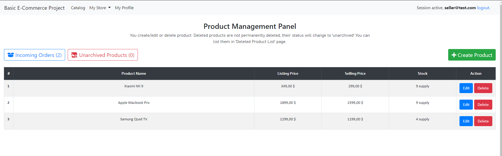
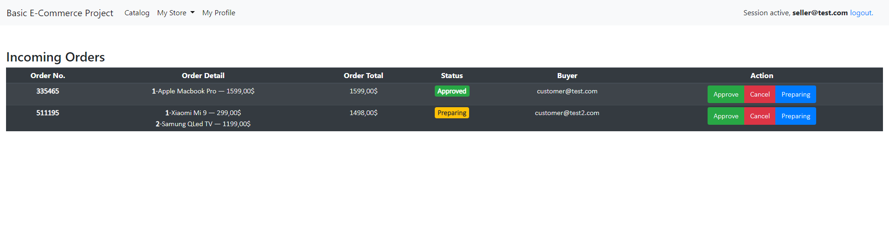
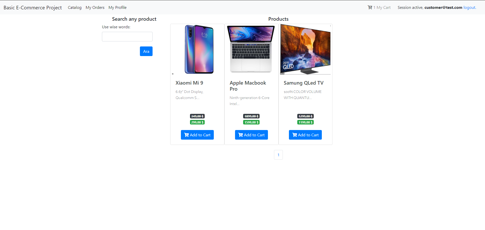
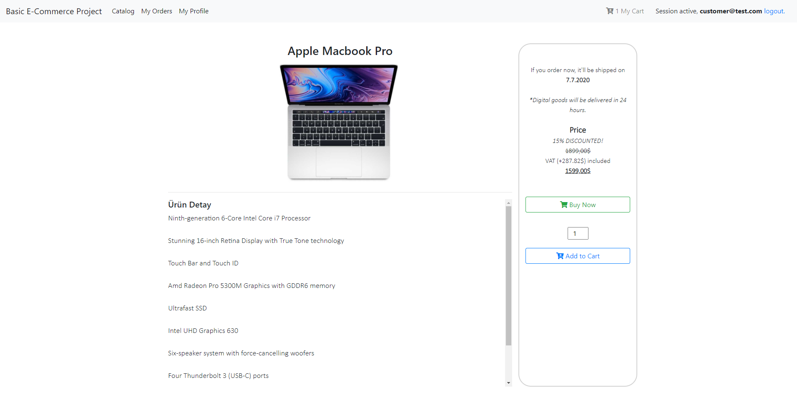
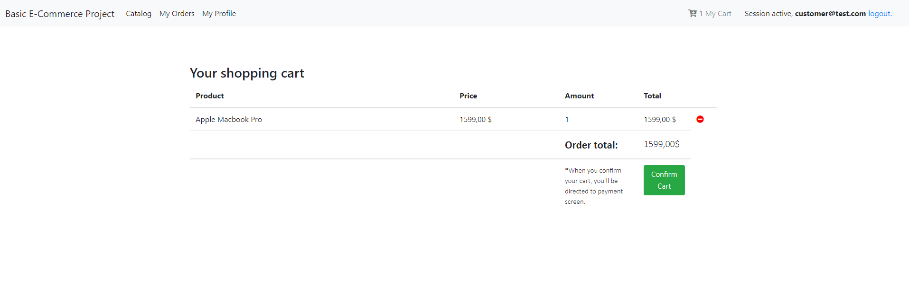
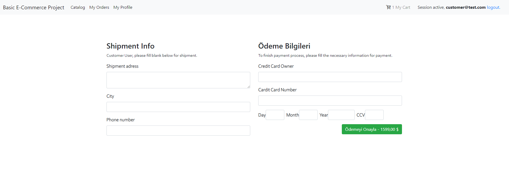
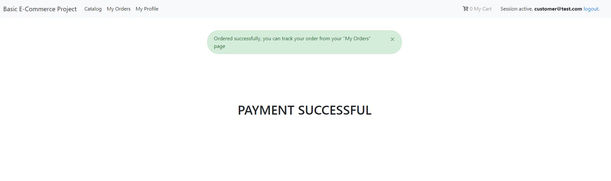
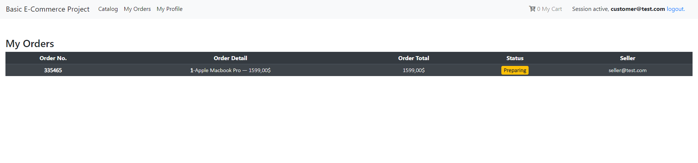

# basic_e_commerce_website
Very basic e-commerce website.

I had to add as .rar, sorry. Maybe later i'll upload it in proper way.

# Seller Side

# Customer Side

# Installing
Activate virtualenv (it is in env file). Install requirements (use requirements.txt), and  done.

# Notes
There are a lot of missing things in this project. Such as in seller's order page there is no information about buyer's shipment adress etc. Because we do not store this information. Also, the payment screen is just fake. In Turkey, we can't use Strip's API. So, yeah... I couldn't find any way to add a real payment section.

This project made for a assignment, so, I didn't build a very detailed project but wanted to add. Also, project first made in Turkish and then I translated all texts to English. There can be untranslated Turkish words.
